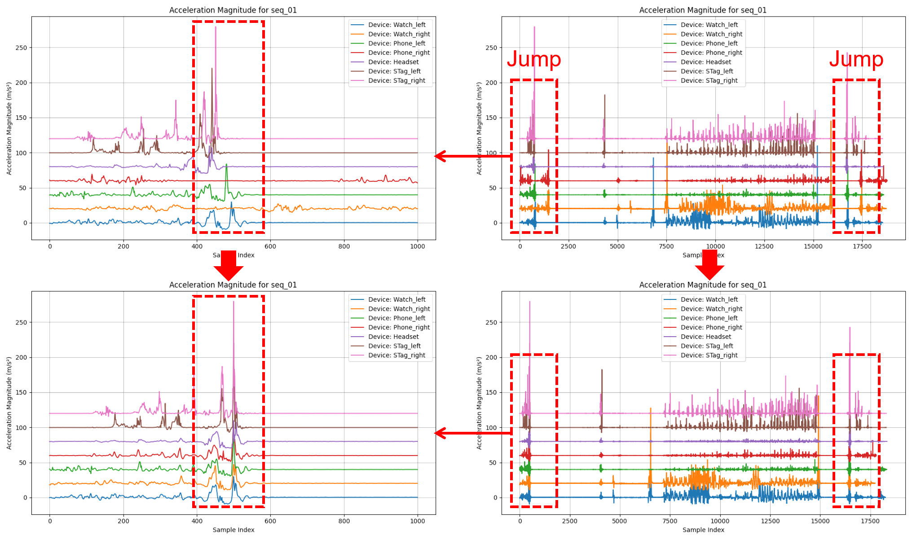
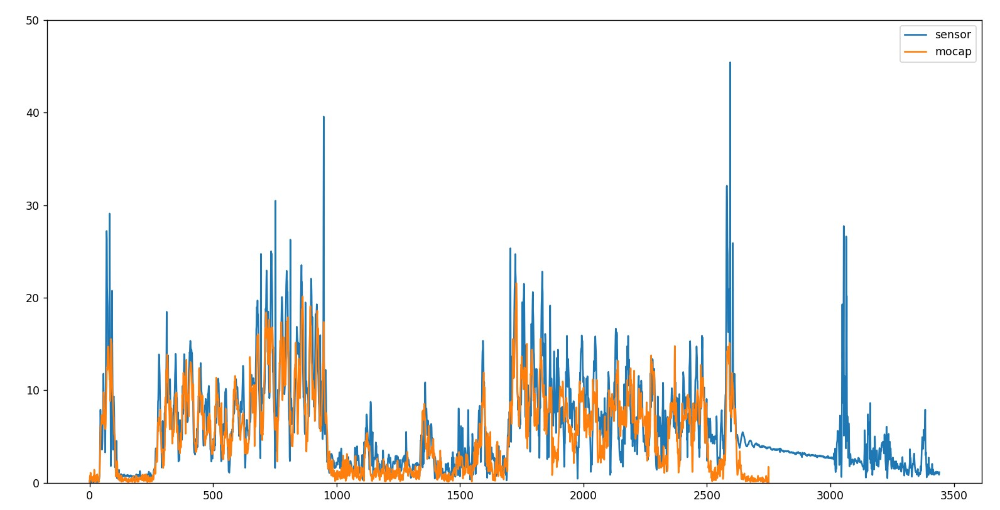

# 数据集使用说明
本项目采集了一个包含时序同步的日常设备（耳机、手表、手机、S-Tag）传感器数据、视频数据以及人体smpl数据的数据集，数据集文件结构及数据处理脚本如下
## 文件结构
```
Dataset/
├── data/
│   ├── processed/
│   │   └── subject/
│   │       └── x.pt (后处理后的数据)
│   ├── raw/
│   │   ├── sensor/
│   │   │   └── subject/ (原始传感器数据)
│   │   ├── smpl/
│   │   │   └── subject/ (视频动捕结果)
│   │   └── xingying/
│   │       └── subject/ (光学动捕结果)
│   └── overview.csv (数据集概览)
├── script...
```
## 数据格式
### 原始传感器数据
包含一个耳机（头部），两个手表（左右手腕），两个手机（左右大腿口袋）和两个S-Tag（左右脚）的原始传感器数据
- 分为左侧和右侧保存，左侧包括左手手表，左侧手机，耳机和左右脚的S-Tag，右侧包括右手手表和右侧手机
- 数据以.csv格式保存
- 帧率略大于100fps
### 视频动捕结果
包含由EasyMocap处理后得到的SMPL数据，帧率为30fps
### 光学动捕结果
包含由基于标记点的光学动捕系统得到的原始数据，原始帧率为90fps，后处理后得到的SMPL数据帧率为30fps
### 后处理后的数据
包含时序同步的传感器数据和 SMPL 数据，具体包括：

| 数据类型       | Shape       |
|----------------|------------|
| **aM**         | `[N, 7, 3]` (全局坐标系下的加速度)|
| **RMB**        | `[N, 7, 3, 3]` (全局坐标系下的旋转矩阵)|
| **acc**        | `[N, 7, 3]` (原始加速度)|
| **gyro**       | `[N, 7, 3]` (角速度)|
| **mag**        | `[N, 4, 3]` (磁力计数据)|
| **quaternion** | `[N, 7, 4]` (四元数旋转)|
| **linear_acc** | `[N, 4, 3]` (线性加速度，只有手表和手机有)|
| **ppg**        | `[N, 2, 11]` (ppg数据，只有两个手表有)|
| **pose_pred**  | `[N, 24, 3, 3]` (模型推理的SMPL pose) |
| **pose_gt**    | `[N, 24, 3, 3]` (视频动捕的SMPL pose) |
| **tran_gt**    | `[N, 3]` (视频动捕的全局位移)|
| **pose_gt_new**| `[N, 24, 3, 3]` (光学动捕refine后的SMPL pose) |

其中，`N` 为总帧数，帧率为30fps，第二维代表不同设备，设备序号如下：

- **0**: 左手手表
- **1**: 右手手表
- **2**: 左侧手机
- **3**: 右侧手机
- **4**: 耳机
- **5**: 左脚 S-Tag
- **6**: 右脚 S-Tag
### 视频数据
由于视频数据过大（每个subject约30G），所以保存在云盘上，视频数据见[视频地址](https://cloud.tsinghua.edu.cn/d/5d0182de985d4ee9b111/)
- 帧率为60fps
### 数据集概览
包含每个subject的基本信息和动作类型等元数据

## 后处理方式
主要分为多传感器数据对齐同步和传感器与SMPL数据对齐两部分
### 多传感器数据对齐
#### 补齐时间戳+拉齐帧率
由于不同设备的帧率不完全相同，且除了手机以外的其他设备存在多条数据共享一个时间戳的情况，所以首先需要对原始数据进行补齐时间戳和拉齐帧率的处理：
```bash
python process_sensor.py
```
该脚本会读取`data/raw/sensor_raw/subject/`目录下的原始传感器数据，进行时间戳补齐，并将帧率拉齐到100fps。此时不同设备的数据统一为100fps，且同一设备下的不同模态数据有相同的总帧数，处理后的数据保存在`data/raw/sensor/subject/`目录下
#### 多设备数据同步
不同设备的数据传输不完全同步，所以需要对不同设备的数据进行同步操作
在实际采集过程中，会让参与者在刚开始采集数据后和结束采集数据前分别做一个向上跳起的动作，给每个设备一个在相同时间下的较大加速度，后续可以通过加速度的峰值来对齐不同设备的数据，具体操作如下：
```bash
python align_sensor.py
```
该脚本会将`data/raw/sensor/subject/`目录下的数据根据前30s的加速度峰值进行时序同步，处理后不同设备具有时序对齐的，相同帧率和总帧数的数据，处理后的数据保存在`data/processed/subject/`目录下
多设备数据同步示意图如下:
<div align="center">
   
</div>

#### 传感器与SMPL数据对齐
首先将传感器数据与SMPL数据降采样到相同的帧率（30fps），然后通过左手腕的加速度峰值进行对齐，具体操作如下：
```bash
python align_smpl.py
```
对齐传感器数据与视频动捕得到的SMPL数据
```bash
python align_xingying.py
```
对齐传感器数据与光学动捕得到的SMPL数据，并用光学动捕得到的上半身手臂pose refine视频动捕得到的SMPL数据
这两个过程需要在终端手动输入+-的量来调整对齐的结果，示意图如下：
<div align="center">
   
</div>

对齐后得到最终的数据保存在`data/processed/subject/`目录下

## 对齐结果可视化
### 环境配置
目前使用Unity引擎进行SMPL模型的可视化，可以通过[链接](https://cloud.tsinghua.edu.cn/f/c1fded497d7f441793e0/?dl=1)下载打包后的Unity项目
### 可视化
可视化前，可以运行
```bash
python inference.py
```
得到根据传感器数据模型推理的SMPL pose数据，作为与GT数据对比的结果

然后打开Unity项目，点击中间上方的Play让Unity编辑器处于运行状态
最后运行命令
```bash
python vis_unity.py
```
即可在Unity中观察到数据集中的GT SMPL结果和当前模型推理的SMPL结果的对比

也可以手动从之前的链接下载视频数据，进行side-by-side的对比